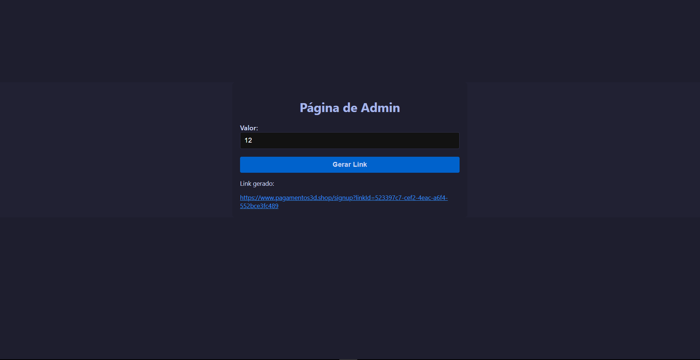

# Sistema de Geração de Links e Pagamentos



Um sistema para gerar links de pagamento e processar transações de forma fácil e segura. Permite a criação de links personalizados para pagamento, que podem ser enviados para clientes. O cliente preenche um formulário e é redirecionado para uma página de pagamento.

## Tecnologias Usadas

- **React**: Para a criação da interface do usuário.
- **Node.js**: Para o backend e processamento de pagamentos.
- **NodeMailer**: Para envio de e-mails de notificação e confirmação.
- **Stripe**: Para processamento de pagamentos.

## Instalação

Siga os passos abaixo para instalar e rodar o projeto localmente.

### Backend

1. Clone o repositório:
    ```bash
    git clone https://github.com/usuario/sistema-geracao-links-pagamentos.git
    ```

2. Navegue até o diretório do backend:
    ```bash
    cd sistema-geracao-links-pagamentos/backend
    ```

3. Instale as dependências:
    ```bash
    npm install
    ```

4. Crie um arquivo `.env` com as variáveis de ambiente necessárias.

5. Inicie o servidor:
    ```bash
    npm start
    ```

### Frontend

1. Navegue até o diretório do frontend:
    ```bash
    cd sistema-geracao-links-pagamentos/frontend
    ```

2. Instale as dependências:
    ```bash
    npm install
    ```

3. Inicie o servidor de desenvolvimento:
    ```bash
    npm start
    ```

## Uso

1. Acesse o frontend no navegador para criar e gerenciar links de pagamento.
2. Complete o formulário com as informações necessárias e gere o link.
3. Envie o link gerado para o cliente.
4. O cliente será redirecionado para a página de pagamento, onde poderá concluir a transação.

## Contribuição

Contribuições são bem-vindas! Siga os passos abaixo para contribuir com o projeto:

1. Faça um fork do repositório.
2. Crie uma branch para sua nova feature (`git checkout -b minha-feature`).
3. Faça commit das suas alterações (`git commit -am 'Adiciona nova feature'`).
4. Faça push para a branch (`git push origin minha-feature`).
5. Crie um Pull Request.

## Licença

Este projeto está licenciado sob a [MIT License](LICENSE).

---

Se você tiver alguma dúvida ou precisar de ajuda, sinta-se à vontade para abrir uma issue ou me contatar!

